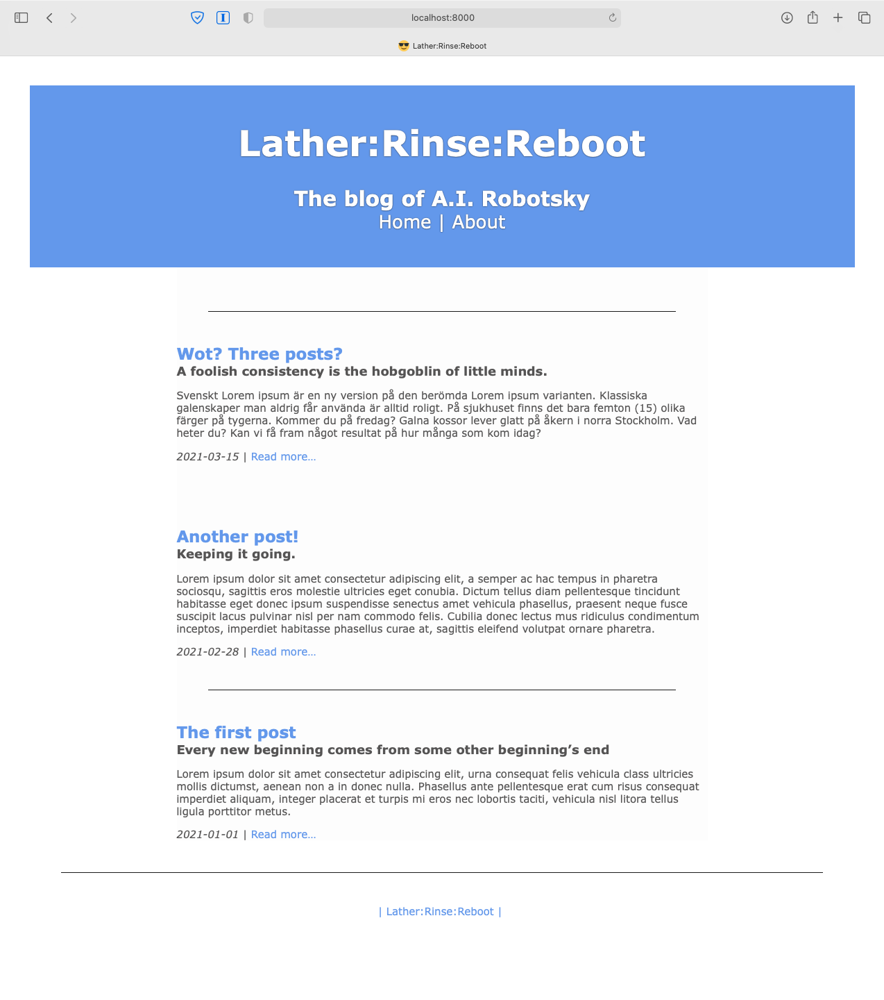
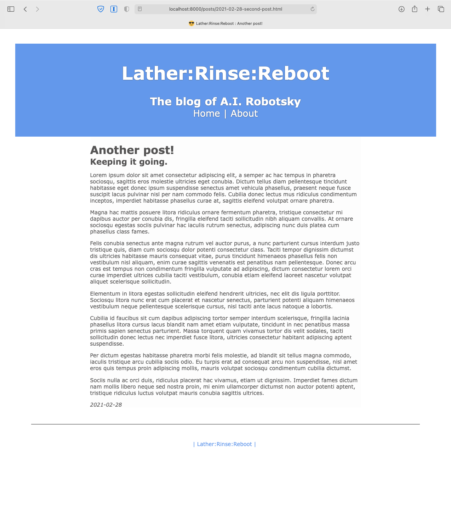

Panblog : a simple static blog generator using pandoc, make, and python
=======================================================================

This repo is an example/template of how to build a markdown-based static site and blog generator using only [Pandoc](https://pandoc.org), [GNU Make](https://www.gnu.org/software/make/), and a bit of Python.  The template is distilled from the code I wrote to support [my own blog](http://jp-fosterson.com).

The design is extremely simple, and is based on the observation that many (most?) static-site blog generators only need to do a small number of simple things:

1. Convert a markdown file into HTML using a template for formatting and reading some metadata from the markdown file to incorporate into the template.  Pandoc is great at that, it already has a template language.
1. Create a blog index for the front page, with a reverse-chronological list of posts with short descriptions.  I can do that in under a hundred lines of Python using `PyYAML` to read post metadata.
1. Generate an RSS feed.  Again, a short Python script using `rfeed` and `PyYAML`.
1. Orchestrate the construction of the site, detecting changed markdown, template files, metadata, images, and CSS, and regenerating the necessary site files, running pandoc, Python scripts, or `cp` as needed.  Totally a job for `make`.

This site does those things, without a ton of code.  It has a single page template and a single stylesheet that you can edit to customize the site appearance.  Source markdown for blogs is stored in a single directory using the Jekyll filename convention:  `src/posts/YYYY-MM-DD-post-name.md`.    It comes with a minimal page template and CSS file as a starting point.

Some screenshots:

<a href="doc/screenshot-index.png"></a><a href="doc/screenshot-post.png"></a>


Setup and Getting Started
-------------------------

Installation requires [Pandoc](https://pandoc.org/installing.html), [GNU Make](https://www.gnu.org/software/make/) (possibly already installed on your system), and Python 3.


### Clone this repo

    git clone https://github.com/jp-fosterson/pandocblog.git
    cd pandocblog

### Pip install requirements

    pip install -r requirements.txt

### Make the example site

`make serve` will build the example site into the `site/` directory and launch a local webserver on port 8000.  Open [http://localhost:8000](http://localhost:8000) in a browser to view the site.


Customization
-------------

### Site title, description, etc.

The site title and so forth are in the `src/site-metadata.yaml` file.

### Stylesheet

Edit `src/assets/main.css` to customize the stylesheet.  The stylesheet is based on the default style section that Pandoc adds to an HTML page when created an HTML page using `--standalone`, but without any stylesheet specified, with a few modifications to make it look like a modern blog style.

The default page template has only three custom `div` classes:
* `header`, for the banner at the top of the page,
* `main`, for the main text of the page, and
* `footer`, for the bottom banner area.

To add a banner image to the header, place your banner image in `src/assets/banner.jpg` and add these lines to the `.header` style in `main.css`:

```
  background-image: url("/assets/banner.jpg");
  background-size: cover;
```

### Page Template

The source page template is stored in `src/templates/page.html`.  It uses [Pandoc template syntax](https://pandoc.org/MANUAL.html#templates) for substitution variables.  It's divided into three `div`s: `header`, `main`, and `footer`.  The header section is formatted like a title banner, the main section is where the page content goes, and the footer is set up to contain ancillary information like social media links, copyright notices, etc.

### Adding Posts

Blog posts are added by putting date-coded markdown files in the `src/posts/` directory.  Post filenames must conform to the pattern `YYYY-MM-DD-a-file-name.md`, similar to the convention used in Jekyll.  Running `make` converts these posts to HTML files in the `site/posts/` directory and updates the site index page.  (Note that, unlike with Jekyll, there are no /year/month/day subdirectories.)

### Adding Pages that aren't Posts

Markdown pages in the `src/pages/` directory (or any subdirectories) are converted to HTML and placed in the `site/` directory.  For example `src/pages/about.md` produces the page `site/about.md`.  Raw HTML pages in `pages` are copied to the corresponding place in the `site/` directory.  No transformation of any kind is applied to them.

Once deployed, non-post pages will be accessible directly by URL, but won't be automatically linked from anywhere within the site.  In order for them to be visible or accessible from within the site, you must link to them from within a post or another page.  One method is to link them from the page header or footer in the page template, `src/templates/page.html`  The "About" page is linked in this way.

### Images and other assets

When you `make` the site or `make assets` the entire contents of `src/assets` is copied into `site/assets`, unmodified.  To use these files, link them using site-relative links, as in `.`

Deploying
---------

`make all` (or just `make`) builds the site into `site/`.  To deploy the site to an AWS static website, edit the Makefile  and set the variable `S3URI` to the URI of your S3 bucket, then use `make sync` to sync the `site/` directory to the bucket.  (NOTE: this uses `aws s3 sync --delete ...` so it may delete files in the bucket.  This is normally what you want, if you remove or rename files locally, but be aware.)

To sync to some other kind of site, copy or `rsync` the `site/` directory to the appropriate place.


Use `make --jobs` for fast rebuilds
-----------------------------------

One reason I like using `make` for orchestrating things like site-build workflows is that it understands the inherent parallelism of the workflow and using `make --jobs` (or `make -j`) will run its make tasks in parallel when possible.  Wherever possible, the `Makefile` on the this project is designed so that each file target is created with a separate task, resulting in very fast builds.  A full clean rebuild of my personal site takes under a second.